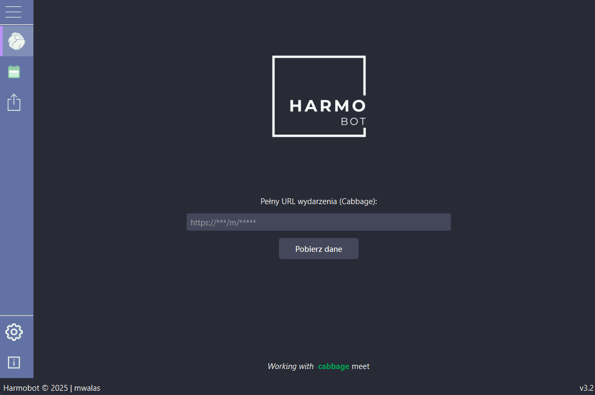
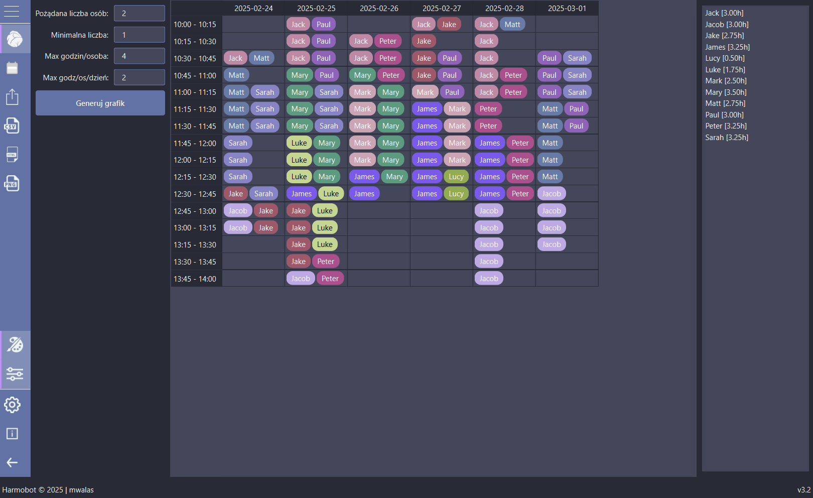

# Harmobot

Harmobot is a desktop GUI application designed for generating optimal work schedules based on participants’ availability. Built using Python and the OR-Tools CP-SAT solver, Harmobot offers an intuitive interface and a robust scheduling algorithm that adapts to real-world constraints.

## Highlights

- 🚀 Advanced CP-SAT algorithm for optimal shift scheduling.
- ⏱ Rapid local processing for high-quality schedules.
- 📊 Drag & drop interface for easy schedule adjustments.
- ➕ Add participants via the plus button or drag them from the summary list.
- 🗑 Remove assignments by dragging chips to the trash drop area.
- 🎨 Fully customizable themes (Light, Dark, Dracula, High Contrast).
- 🔗 Integration with Timeful (antecedently known as Schej) and Cabbagemeet for availability data.
- 📑 Export schedules as CSV, HTML, or PNG.
- 🖥️ Supports macOS, Linux, and Windows.

## Overview

Harmobot leverages the services provided by **Timeful** and **Cabbagemeet** to retrieve participant availability data. The application builds upon their open-source infrastructure to deliver a powerful scheduling solution.

Gathering people's availability is simple - choosing a single meeting time that suits everyone is straightforward. However, planning a detailed schedule for a group based on individual time availability can be challenging. The scheduling algorithm, when processing extensive input data (e.g., numerous days and a large number of participants with diverse availabilities), requires significant computational power. Without resource and time limits, finding the optimal solution can be very time-consuming. This challenge was the primary motivation for implementing Harmobot as a desktop application, ensuring heavy computations run locally. While a future web version is not ruled out, the current design maximizes performance for complex scheduling scenarios.

Harmobot is distributed as a standalone desktop application and can be built into an executable using PyInstaller.



## Key Features

- **Intelligent Scheduling:**  
  Utilizes a cost-function based algorithm to assign shifts optimally, taking into account minimum and maximum availability, continuity rewards, gap penalties, and daily coverage bonuses.

- **Dual Integration Support:**  
  Seamlessly works with the open-source infrastructures provided by Timeful and Cabbagemeet. Users can run their own servers with these projects to legally harness full API functionality for collecting availability data.

- **User-Friendly GUI with Drag and Drop:**  
  Enjoy an interactive interface that supports drag-and-drop editing. You can double-click any cell to edit occupant names or move “chips” (participants) from one cell to another simply by dragging them. Also drag a participant from the summary panel onto a slot to add them. Adjust the generated schedule easily in case of any errors or discrepancies.

- **Real-Time Availability Preview:**  
  Click on a participant's name in the summary panel to highlight that participant’s availability across the schedule. This makes it simple to see who is available in each time slot.

- **Manual Editing and Error Correction:**  
  The schedule highlights cells where designated working hours are exceeded and allows you to manually add participants - even those not originally in the list - to any cell. Remove an assignment by dragging a chip from the schedule into the trash drop area.

- **Color-Coded Participant Chips:**  
  Quickly identify participants with a consistent chip color assigned to each person. This feature is especially useful for rapid recognition and tracking across the schedule.

- **Data Export Options:**  
  Export schedules in multiple formats including CSV, HTML, and PNG for ease of sharing and record keeping.

- **Parameters:**  
  A parameter panel lets you configure the desired and minimum number of participants per slot, as well as maximum hours per person or per day.

- **Customizable Settings:**  
  A dedicated Settings dialog allows you to pick from multiple UI themes (Light, Dark, Dracula, High Contrast, Firemode, etc.), adjust solver time limits, specify the number of CPU threads to use, and set time-zone offsets for events.

- **Version Check:**  
  On startup, Harmobot automatically checks whether the local version is up-to-date with the latest release (via Cloudflare Workers), ensuring you are always running the most current version.

<br>


## System Requirements

- **Python:** Version 3.9 or higher
- **Dependencies:**  
  • PyQt6  
  • OR-Tools  
  • Requests  
  • python-dateutil  
  • (Additional dependencies as listed in the requirements file)

## Installation

1. **Clone the Repository:**

```bash
       git clone https://github.com/m-walas/Harmobot.git
       cd harmobot
```

2. **Install Dependencies:**  

```bash
       pip install -r requirements.txt
```

3. **Run the Application:**

```bash
       python main.py
```

> [!NOTE]
> For users preferring a standalone executable, Harmobot can be bundled into a binary using PyInstaller. Instructions are provided below.

## Usage

Upon launching Harmobot, you will be greeted with a user-friendly window where you can:

- **Import Data:**  
  Input a Timeful or Cabbagemeet URL to fetch participant availability.
  
- **Configure Scheduling Parameters:**  
  Set the number of required participants, minimum requirements, and working hour limits.
  
- **Generate Schedules:**  
  Run the scheduling algorithm to produce an optimal work schedule. A dedicated Settings dialog lets you tune the solver’s time limit or CPU thread usage.
  
- **Adjust and Edit the Schedule:**  
  Utilize drag and drop functionality to manually adjust assignments in case of any errors. The application also provides a real-time availability preview - click on a participant's name to view when they are available - and highlights cells that exceed set working hour limits. You can even add participants manually to any cell by double-clicking if necessary or drag a participant from the summary panel onto a desired shift slot.
  
- **Export Results:**  
  Save the generated schedule as CSV, HTML, or PNG.

## Backend & Algorithm Details

Harmobot’s scheduling engine is powered by a constraint programming model using OR-Tools. Key components include:

1. **Decision Variables:**  
   Binary variables represent whether a participant is assigned to a specific time slot.

2. **Constraints:**  
   - **Shift Coverage:** Ensures that each slot is staffed by at least a minimum and at most a maximum number of participants.  
   - **Availability Matching:** Considers both standard availability and "ifNeeded" slots for each participant.  
   - **Time Limits:** Enforces daily and overall working-hour restrictions specified via the parameter panel.

3. **Objective Function:**  
   The algorithm maximizes overall scheduling efficiency by:
   - Rewarding continuous shift assignments.
   - Penalizing unnecessary gaps between shifts.
   - Awarding bonus points for full-day coverage.
   - Deducting points for assignments made on an “ifNeeded” basis.

While the algorithm strives to produce an optimal schedule based on the provided constraints, it may not always assign shifts perfectly. That is why Harmobot includes features such as drag and drop editing, real-time availability preview, and manual adjustment options - empowering you to fine-tune the schedule as needed.

## Integration

Harmobot is designed to work seamlessly with the open-source infrastructures provided by **Timeful** and **Cabbagemeet**. Both projects are available on GitHub:

- [Timeful](https://github.com/schej-it/timeful.app)
- [Cabbagemeet](https://github.com/maxerenberg/cabbagemeet)

These services allow you to set up your own server with the full functionality of collecting and processing availability data. Harmobot integrates with this architecture, offering an enhanced, local scheduling tool without requiring reliance on external APIs.

> [!CAUTION]
> We do not support or assume responsibility for the use of Timeful or Cabbagemeet infrastructures. Harmobot is built on top of these open-source solutions solely as an additional tool to facilitate manual scheduling. Users are encouraged to deploy their own servers if they wish to leverage the full capabilities of these services.

## License

Harmobot is released under the **AGPL-3.0** license. See the LICENSE file for more details.

## Disclaimer 🚩

> [!CAUTION]
> This program should only be used on environments that you own or have explicit permission to do so. Neither the author, nor other parties involved in the project, will be held liable for any illegal use of this program.

## Contribute

Did you enjoy the project? Feel free to give it a star on GitHub ⭐. Got an interesting idea for further development? Don't hesitate to reach out and share your thoughts!

<details>
  <summary><strong>How to Build</strong></summary>

### Windows

- **First Build (No .spec):**

```bash
       pyinstaller --name Harmobot --onefile --windowed --icon=assets\harmobot_logo.ico --add-data "assets;assets" main.py
```

### Linux

- **First Build (No .spec):**

```bash
       pyinstaller --name Harmobot --onefile --windowed --icon=assets/harmobot_logo.ico --add-data "assets:assets" main.py
```

### macOS

- **First Build (No .spec):**

```bash
       pyinstaller --name Harmobot --onedir --windowed --icon=assets/harmobot_logo.icns --add-data "assets:assets" main.py
```

**Additional Info:**

Ensure that your assets folder is structured as follows to guarantee proper display of all images, icons, and other resources:

```bash
       assets/
       ├── icons/
       │   ├── dark/
       │   │   └── *.png
       │   ├── light/
       │   │   └── *.png
       │   └── *.png
       ├── *.png
       ├── *.gif
       ├── harmobot_logo.ico   (for Windows/Linux)
       └── harmobot_logo.icns  (for macOS)
```

> [!TIP]
> When building with PyInstaller, including the entire `assets` folder in the .spec file is crucial for proper loading of all icons and images. For example, your .spec file should include a datas section similar to the following:
>
>```python
>       import os
>
>       datas = [
>           (os.path.join("assets", "icons", "dark"), os.path.join("assets", "icons", "dark")),
>           (os.path.join("assets", "icons", "light"), os.path.join("assets", "icons", "light")),
>           (os.path.join("styles"), os.path.join("styles")),
>           ("assets/icons/update.png", "assets/icons"),
>           ("assets/harmobot_logo_dark.png", "assets"),
>           ("assets/harmobot_logo_light.png", "assets"),
>           ("assets/harmobot_fire.gif", "assets"),
>           ("assets/harmobot_logo.ico", "assets"),
>           ("assets/harmobot_logo.icns", "assets"),
>       ]
>```

If you haven't modified files that affect the GUI (such as icons, images, or other assets), you can simply rebuild using the existing spec file:

```bash
       pyinstaller Harmobot.spec
```

</details>
